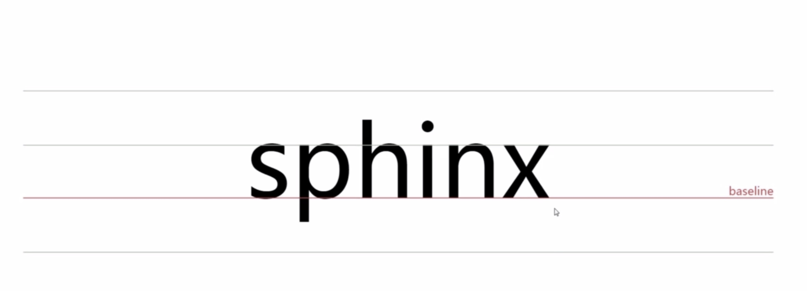
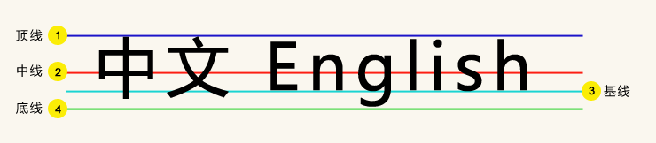
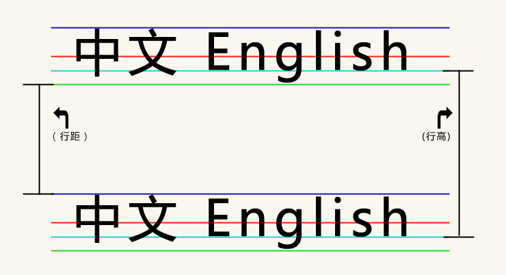
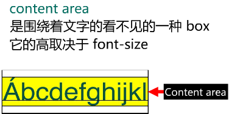
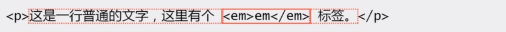

# line-height

- line-height 定义
- line-height 与行内框盒子模型
- line-height 的高度机理(机制原理)
- line-height 各类属性值
- 学习资料
  <br/>
  <br/>

## 1. line-height 定义

line-height：行高指的是两行文字基线之间的距离。

### 什么是基线：



基线（baseline），指的是一行字横排时下沿的基础线，基线并不是汉字的下端沿，而是英文字母 x 的下端沿。

### 基线乃\*线定义之根本。(顶线、中线、底线)



### 行距与行高(文本行的基线间的距离)：


<br/>
<br/>
<br/>

## 2. line-height 与行内框盒子模型

所有内联元素的样式表现都与行内框盒子模型有关！

```html
<p>这是一行普通的文字，这里有个<em>em</em>标签。</p>
```

这普通的一行包含了 4 种盒子，下面详解。

1)、内容区域(content area)，是一种围绕文字看不见的盒子。内容区域的大小与 font-size 大小相关。



2)、内联盒子(inline boxes)，内联盒子不会让内容成块显示，而是排成一行。如果(文字)外部包含 inline 水平的标签(span、a、em、strong 等)，则属于内联盒子。如果是个光秃秃的文字，则属于匿名内联盒子。



3)、行框盒子(line boxes)，每一行就是一个行框盒子，每个行框盒子又是由一个一个内联盒子组成。

4)、p 标签所在的包含盒子(containing box)，此盒子有一行一行的行框盒子组成。
<br/>
<br/>

## 3. line-height 的高度机理(机制原理)

内联元素的高度是由行高决定的！

我们需要知道：

1)、行高由于其继承性，影响无处不在，即使单行文本也不例外。

2)、行高只是幕后黑手，高度的表现不是行高，而是内容区域和行间距。

内容区域高度(content area)+行间距(vertical spacing)=行高(line-height)

注意：

- 内容区域(content area)高度只与字号(font-size)以及字体(font-size)有关，与 line-height 没有任何关系。

- 在 simsun 字体(即宋体)下，内容区域高度等于文字大小值。所以，在 simsun 字体下，font-size+行间距=line-height。

行间距上下拆分，就有了半行间距。

```html
<!DOCTYPE html>
<html lang="en">
<head>
  <meta charset="UTF-8">
  <title>line-height</title>
  <style>
    p {
      width: 500px;
    }
    .test1 {
      font-size: 36px;
      line-height: 1px;
      background: green;
      border: 1px solid #FFF
    }

    .test2 {
      font-size: 0px;
      line-height: 36px;
      background: green;
      border: 1px solid #FFF
    }

    .test3 {
      font-size: 32px;
      line-height: 24px;
      background: green;
      border: 1px solid #FFF
    }
  </style>
</head>
<body>
  <p class="test1">测试：行高是由字体撑开的</p>
  <br>
  <br>
  <p class="test2">测试：行高是由line-height 决定的</p>
  <br>
  <br>
  <p class="test3">测试：font-size: 32px;line-height: 24px;</p>
</body>
</html>
```

[查看页面](http://localhost:4000/html/height.html)

总结：
  * 1、行高决定内联盒子的高度；
  * 2、行间距墙头草，可大可小(甚至负值)，保证高度正好等于行高。
  
  在宋体字体下，如果 line-height 小于 font-size，inline box 会优先于行高，以保证 inline box 的高度正好等于行高。
  例：font-size: 16px; line-height: 12px; inline box 高度为 12px。content area 会溢出，inline box 的顶部和底部半行高会折叠起来，以保证 inline box 的高度。
<br/>
<br/>

## 4. line-height 各类属性值

line-height 支持的属性值：normal、number、length、percent、inherit(继承)

1)、line-height:normal 是默认属性值，对应的具体的行高值是跟着用户的浏览器走的，且与元素字体关联。如下例(在 chrome 浏览器下，在火狐浏览器下可能有偏差)：

```html
<!DOCTYPE html>
<html>
  <head>
    <meta charset="UTF-8">
    <title>Document</title>
    <style type="text/css">
      div {
        font-size: 100px;
        width: 500px;
      }

      .div1 {
        line-height: normal;
        font-family: "Microsoft YaHei";
        background: red;
      }

      .div2 {
        line-height: normal;
        font-family: "SimSun";
        background: orange
      }

    </style>
  </head>
  <body>
    <div class="div1">
      <p class="p1">微软雅黑<br>字体100px</p>
    </div>
    <div class="div2">
      <p class="p2">宋体<br>字体100px</p>
    </div>
  </body>
</html>
```

[查看页面](http://localhost:4000/html/line-height-normal.html)

2)、line-height:number 设置数字，此数字会与当前的字体尺寸相乘来设置行间距。 如下例：

```html
<!DOCTYPE html>
<html>
<head>
  <meta charset="UTF-8">
  <title>Document</title>
  <style type="text/css">
    div {
      font-size: 30px;
      width: 500px;
    }

    .p1 {
      line-height: 1.5;
      font-family: "Microsoft YaHei";
      background: red;
    }
  </style>
</head>

<body>
  <div class="div1">
    <p class="p1">line-height: 1.5;
      <br>30px</p>
  </div>
</body>
</html>
```

[查看页面](http://localhost:4000/html/line-height-number.html)

3)、line-height:length 设置固定的行间距。如下例：

line-height:20px(固定单位,像素)
px：像素 px 是相对于显示器屏幕分辨率而言的

line-height:20pt(固定单位，也不知道 pt 是？)
pt：印刷业上常使用的单位，磅的意思，一般用于页面打印排版。

line-height:1.5em(相对单位)em：是相对长度单位。相对于当前对象内文本的字体尺寸。如当前对行内文本的字体尺寸未被人为设置，则相对于浏览器的默认字体尺寸(引自 CSS2.0 手册)。任意浏览器的默认字体高都是 16px。

line-height:1.5rem(相对单位，不知道 rem 是？)rem 是 CSS3 新增的一个相对单位（root em，根 em）。与 em 区别在于使用 rem 为元素设定字体大小时，仍然是相对大小，但相对的只是 HTML 根元素。目前，除了 IE8 及更早版本外，所有浏览器均已支持 rem

```html
<!DOCTYPE html>
<html>
<head>
  <meta charset="UTF-8">
  <title>Document</title>
  <style type="text/css">
    body {
      font-size: 30px;
      width: 500px;
    }

    .p1 {
      line-height: 45px;
      font-family: "Microsoft YaHei";
      background: red;
    }

    .p2 {
      line-height: 45px;
      font-family: "Microsoft YaHei";
      background: red;
    }

    .p3 {
      line-height: 1.5em;
      font-family: "Microsoft YaHei";
      background: red;
    }

    .p4 {
      line-height: 1.5rem;
      font-family: "Microsoft YaHei";
      background: red;
    }

  </style>
</head>

<body>
  <div class="div1">
    <p class="p1">line-height: 45px;
      <br>30px</p>
  </div>

  <div class="div1">
    <p class="p2">line-height: 45pt;
      <br>30px</p>
  </div>

  <div class="div1">
    <p class="p3">line-height: 1.5em;
      <br>30px</p>
  </div>

  <div class="div1">
    <p class="p4">line-height: 1.5rem;
      <br>30px</p>
  </div>
  <input type="number" />
  <button onclick="handleUpdateFontSize('body')">修改body字体</button>
  <button onclick="handleUpdateFontSize('html')">修改html字体</button>
</body>

<script>
  function handleUpdateFontSize(type) {
    let size = document.querySelector('input').value
    if (!size || size < 0) return alert('请输入大于0的正数。');
    document.querySelector(type).style.fontSize = size + 'px';
  }
</script>
</html>
```

[查看页面](http://localhost:4000/html/line-height-length.html)

4)、line-height:percent，基于当前字体尺寸的百分比行间距。如下例：

```html
<!DOCTYPE html>
<html>
<head>
  <meta charset="UTF-8">
  <title>Document</title>
  <style type="text/css">
    div {
      font-size: 30px;
      width: 500px;
    }

    .p1 {
      line-height: 150%;
      font-family: "Microsoft YaHei";
      background: red;
    }
  </style>
</head>

<body>
  <div class="div1">
    <p class="p1">line-height: 150%;
      <br>30px</p>
  </div>
</body>
</html>
```

[查看页面](http://localhost:4000/html/line-height-percent.html)

5)、line-height:inherit，规定应该从父元素继承 line-height 属性的值(计算值)。 如下例：

```html
<!DOCTYPE html>
<html>

<head>
  <meta charset="UTF-8">
  <title>Document</title>
  <style type="text/css">
    div {
      width: 500px;
    }

    .p1 {
      line-height: 30px;
      font-family: "Microsoft YaHei";
      background: rgb(199, 158, 158);
    }

    .span1 {
      line-height: inherit;
      font-size: 40px;
      font-family: "Microsoft YaHei";
    }
  </style>
</head>

<body>
  <div class="div1">
    <p class="p1">
      <span class="span1">
        p2 line-height: inherit; 40px;
      </span>
    </p>
  </div>
</body>
</html>
```

[查看页面](http://localhost:4000/html/line-height-inherit.html)

问题：line-height:1.5、line-height:150%、line-height:1.5em 有什么区别？

```html
<!DOCTYPE html>
<html>
  <head>
    <meta charset="UTF-8">
    <title>Document</title>
    <style type="text/css">
      div {
        font-size: 24px;
        width: 500px;
      }

      /* .div1 {
        line-height: 45px;
        background: red;
      }

      .div2 {
        line-height: 1.5;
        background: orange
      }

      .div3 {
        line-height: 150%;
        background: rgb(224, 170, 170);
      } */

      p {
        font-size: 30px;
      }

      .p1 {
        line-height: 45px;
        background: red;
      }

      .p2 {
        line-height: 1.5;
        background: orange
      }

      .p3 {
        line-height: 150%;
        background: rgb(224, 170, 170);
      }

    </style>
  </head>

  <body>
    <div class="div1">
      <p class="p1">我的font-size = 30px
        <br/>我的line-height = 45px;</p>
    </div>

    <div class="div2">
      <p class="p2">我的font-size = 30px
        <br/>我的line-height = 1.5;</p>
    </div>

    <div class="div3">
      <p class="p3">我的font-size = 30px
        <br/>我的line-height = 150%;</p>
    </div>
  </body>
<html>
```

[查看页面](http://localhost:4000/html/line-height-param.html)

答案：从计算上来讲，是没有任何差别的。但应用元素有差别：

line-height:1.5：所有可继承元素根据 font-size 重计算行高。

line-height:150%/1.5em：当前元素根据 font-size 计算行高，继承给下面的元素。
<br/>
<br/>

## 5. 学习资料

[CSS 深入理解之 line-height(视频)](http://www.imooc.com/learn/403)

[CSS 深入理解之 line-height(文档)](https://www.bbsmax.com/A/8Bz84NM6zx/)
